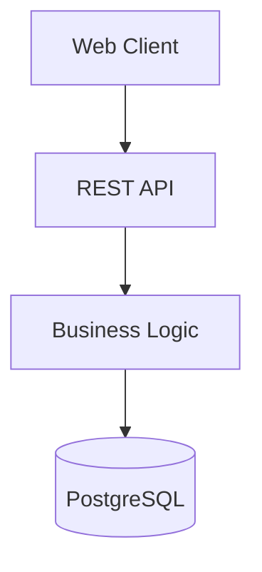
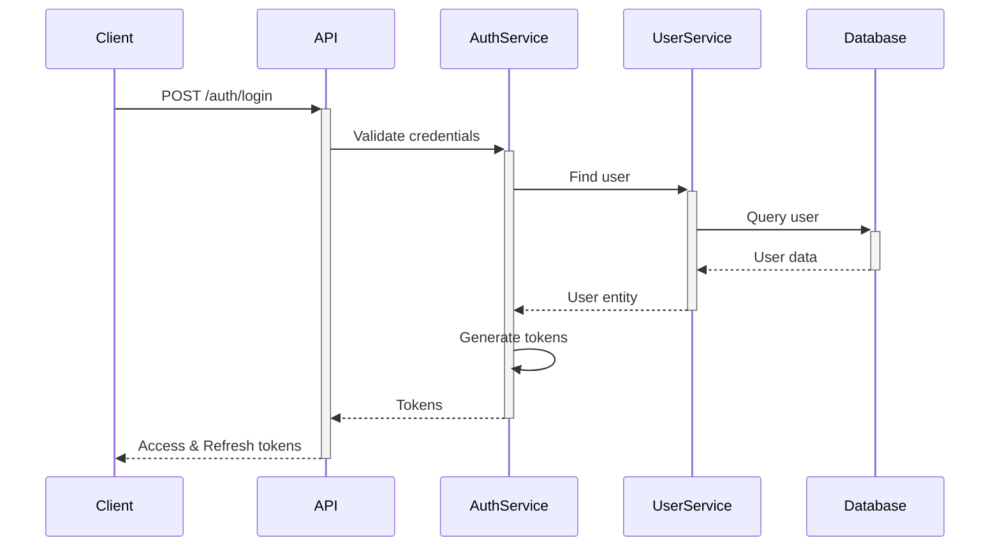
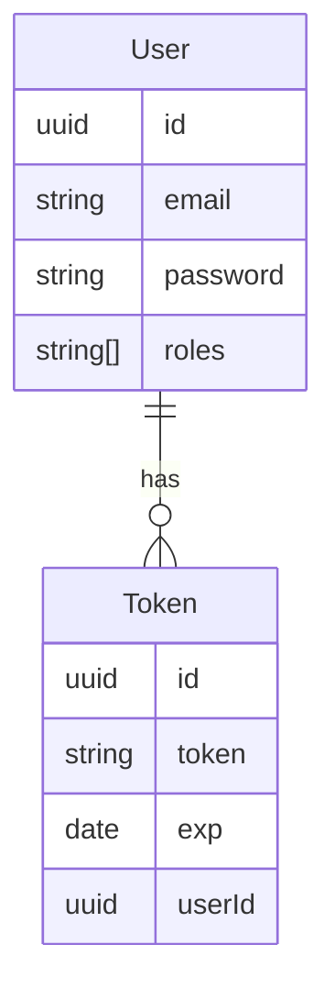

# Архитектура Anivoria

## Общий обзор

Anivoria построена на основе современной многоуровневой архитектуры с разделением на frontend и backend части.



## Backend архитектура

### Технологический стек
- NestJS (Node.js фреймворк)
- PostgreSQL (основная база данных)
- Prisma (ORM)
- JWT (аутентификация)
- BCrypt (хеширование паролей)

### Структура проекта

```
server/
├── src/
│   ├── auth/                 # Аутентификация и авторизация
│   │   ├── config/          # Конфигурация JWT
│   │   ├── dto/            # Data Transfer Objects
│   │   ├── auth.controller.ts
│   │   ├── auth.service.ts
│   │   └── auth.module.ts
│   ├── user/                # Управление пользователями
│   │   ├── dto/
│   │   ├── user.controller.ts
│   │   ├── user.service.ts
│   │   └── user.module.ts
│   ├── prisma/              # Работа с базой данных
│   │   ├── prisma.service.ts
│   │   └── prisma.module.ts
│   └── app.module.ts        # Корневой модуль приложения
```

### Модульная архитектура

NestJS использует модульную архитектуру, где каждый модуль отвечает за определенную функциональность:

- **AppModule** - корневой модуль, объединяющий все остальные
- **AuthModule** - аутентификация и авторизация
- **UserModule** - управление пользователями
- **PrismaModule** - взаимодействие с базой данных

### Слои приложения

1. **Controllers** - обработка HTTP запросов
2. **Services** - бизнес-логика
3. **Prisma Service** - доступ к базе данных

## Система аутентификации



### Токены
- **Access Token**: JWT, срок жизни 1 час
- **Refresh Token**: UUID v4, срок жизни 30 дней

## База данных

### Основные сущности



## Безопасность

1. **Аутентификация**
   - JWT токены
   - Refresh tokens для продления сессии
   - Хеширование паролей с помощью BCrypt

2. **Авторизация**
   - Ролевая система доступа
   - Валидация токенов
   - Защита эндпоинтов

3. **Валидация данных**
   - DTO валидация с помощью class-validator
   - Типизация с помощью TypeScript

## Масштабируемость

Архитектура позволяeт легко добавлять новые модули и функциональность:

1. **Горизонтальное масштабирование**
   - Stateless архитектура API
   - Возможность запуска нескольких инстансов

2. **Вертикальное масштабирование**
   - Модульная структура
   - Независимые сервисы
